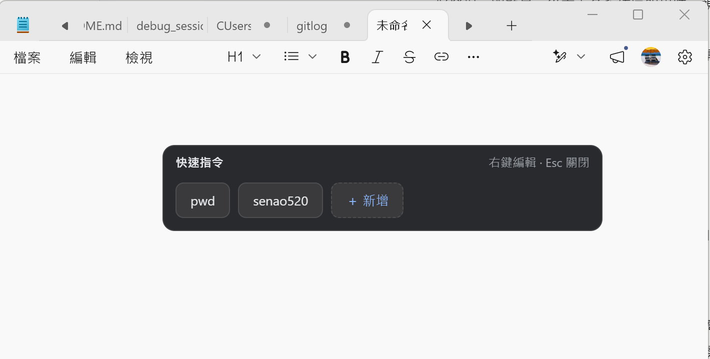
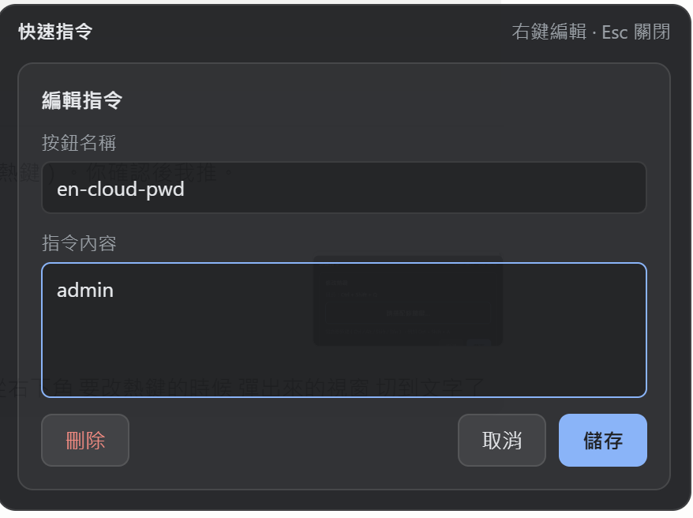
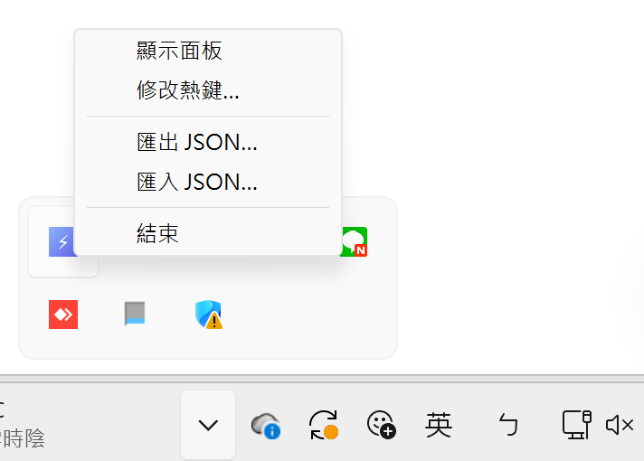

# book-hotkey ⚡

快速貼上指令的跨平台懸浮小工具。程式在背景常駐，按下熱鍵（預設 **Ctrl + Shift + A**）即在游標附近叫出懸浮面板，點一下按鈕就把你預先設定好的文字片段貼到目前游標處——常用密碼、帳號、指令、罐頭回覆，一鍵搞定。

- 🪶 **輕量**：安裝檔約 1～2 MB，記憶體佔用約 15～30 MB
- 🌐 **跨平台**：Windows / macOS / Linux
- ⌨️ **全域熱鍵**：任何程式中都能呼叫，可自訂
- 🔒 **單一實例**：不會重複開啟
- 📦 **可攜**：指令清單支援匯出 / 匯入 JSON

---

## 畫面預覽

### 懸浮面板
按下熱鍵，面板在游標附近彈出，點按鈕即把文字貼到原本游標處；面板會依按鈕數量自動調整大小，失焦或按 `Esc` 自動隱藏。



### 新增 / 編輯指令
在按鈕上按**右鍵**即可編輯（或點「＋ 新增」建立）。設定「按鈕名稱」與要貼上的「指令內容」，可隨時刪除。



### 系統匣選單
程式常駐於系統匣（工作列右下角 ⚡ 圖示），左鍵點開選單：



| 選單項目 | 功能 |
|----------|------|
| 顯示面板 | 叫出懸浮面板（等同按熱鍵） |
| 修改熱鍵… | 自訂呼叫面板的全域熱鍵 |
| 匯出 JSON… | 把指令清單匯出成檔案備份 / 分享 |
| 匯入 JSON… | 從檔案匯入指令清單（即時套用） |
| 結束 | 關閉程式 |

---

## 使用方式

1. 安裝後程式自動在背景啟動（並設定開機自啟動），系統匣出現 ⚡ 圖示。
2. 在任何可輸入文字的地方，把游標放好。
3. 按 **Ctrl + Shift + A**（或從系統匣點「顯示面板」）叫出面板。
4. 點擊指令按鈕 → 文字立刻貼到游標處。
5. 第一次使用先點「＋ 新增」建立你的指令；右鍵既有按鈕可編輯 / 刪除。

> 貼上採「暫存剪貼簿 → 寫入指令 → 模擬貼上 → 還原剪貼簿」流程，貼完會還原你原本的剪貼簿內容。

### 修改熱鍵
系統匣選單 →「修改熱鍵…」→ 點輸入框後按下新的組合鍵（需含 Ctrl / Alt / Shift / Win 等修飾鍵）→ 儲存。新熱鍵立即生效並持久化保存。

### 設定檔位置
指令清單與熱鍵設定存於：

| 平台 | 路徑 |
|------|------|
| Windows | `%APPDATA%\com.senao.bookhotkey\commands.json` |
| macOS | `~/Library/Application Support/com.senao.bookhotkey/commands.json` |
| Linux | `~/.config/com.senao.bookhotkey/commands.json` |

---

## 技術棧

- **Tauri 2**（Rust 後端 + 系統 WebView 前端，檔案小、省資源）
- 前端：原生 HTML / CSS / JS（`withGlobalTauri`，無打包器）
- 全域熱鍵：`tauri-plugin-global-shortcut`（可自訂）
- 開機自啟動：`tauri-plugin-autostart`
- 檔案對話框：`tauri-plugin-dialog`（匯入 / 匯出）
- 單一實例：`tauri-plugin-single-instance`
- 模擬貼上：`enigo`（鍵盤模擬）+ `arboard`（剪貼簿）

---

## 開發

需求：Node.js、Rust toolchain。

```bash
npm install          # 安裝 Tauri CLI
npm run dev          # 開發模式（熱重載）
npm run build        # 打包當前平台安裝檔
```

---

## 發佈（多平台 CI/CD）

推送 `v*` 標籤即觸發 GitHub Actions，於 **Windows / macOS (Intel + Apple Silicon) / Linux** 同時打包，並**直接發佈** Release 附上各平台安裝檔：

```bash
git tag v1.0.1
git push origin v1.0.1
```

亦可在 Actions 頁面手動 `workflow_dispatch` 觸發。

各平台產物：

| 平台 | 安裝檔 |
|------|--------|
| Windows | `setup.exe`（NSIS） |
| macOS | `.dmg` / `.app`（Intel 與 Apple Silicon 各一） |
| Linux | `.deb` + `.AppImage` |

> macOS / Linux 產物未做程式碼簽章；macOS 首次開啟需右鍵「打開」繞過 Gatekeeper。

---

## 已知平台限制

- **macOS**：模擬貼上需在「系統設定 → 隱私權與安全性 → 輔助使用 (Accessibility)」授權本程式。
- **Linux**：支援 X11；Wayland 對全域熱鍵與模擬輸入限制較多，列為已知限制。
